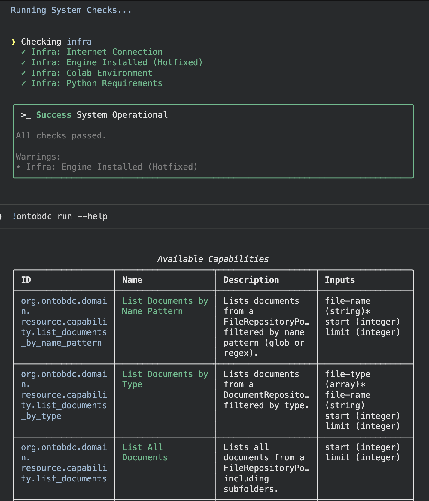

# OntoBDC

> OntoBDC is a structured domain and semantic data foundation for engineering systems.

  

## Used by

- [InfoBIM](https://infobim.org)

OntoBDC provides the conceptual and data architecture layer that enables interoperable, auditable, and automation-ready engineering workflows.

It defines how capabilities, actions, and use cases are organized and executed across technical domains.

## 📄 License

Licensed under **Apache 2.0**.
