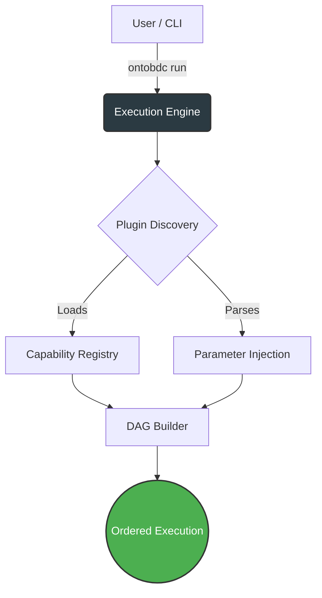
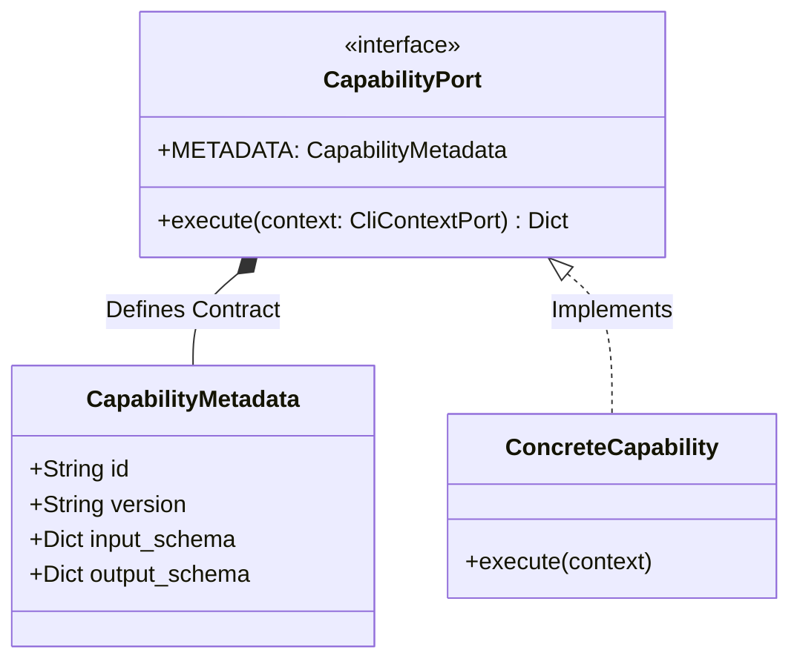
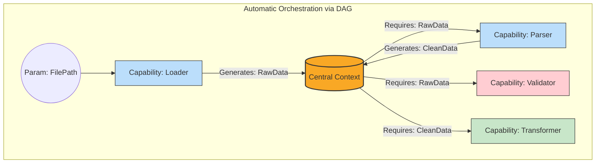

# OntoBDC

OntoBDC is a Python CLI and semantic runtime for defining, discovering, validating, and executing capability-based workflows over structured data and semantic context.

It is designed to make workflow execution predictable and auditable through explicit capability metadata, schema-driven inputs and outputs, and verification steps such as environment checks, contracts, and storage indexing.

In practice, OntoBDC focuses on:
*   **Context and Configuration Management:** Initializes and manages local project configuration in `.__ontobdc__` and runs pre-flight checks to reduce environment drift before execution.
*   **Capability Discovery and Execution:** Uses a plugin-based architecture to discover executable capabilities dynamically and expose them through the CLI.
*   **Storage Indexing:** Maintains a persistent RDF storage index (`storage.ttl`) that records dataset metadata and locations for consistent runtime references.
*   **State-Machine Orchestration:** Drives processes and transformations through explicit runtime states, with progress materialized in physical artifacts such as `raw.txt`, `parsed.json`, and `graph.ttl`.

Architecturally, OntoBDC is organized as a non-monolithic core with dependency injection across logical components such as `init`, `check`, `run`, `list`, `storage`, `dev`, and `a3`, while remaining extensible through additional features and capabilities.

The project is under active development and is especially suited to domains that require clear contracts, traceability, and high compliance, such as BIM/openBIM and engineering data pipelines.

## Documentation

- Specifications: [documentation/spec/](documentation/spec/)
- Roadmap And RFCs: [documentation/roadmap/README.md](documentation/roadmap/README.md)
- Tests: [documentation/test/README.md](documentation/test/README.md)
- Architecture Decisions: [documentation/adr/](documentation/adr/)

## Quickstart

1. Initialize a project context:
   - `ontobdc init`
2. Validate environment and configuration:
   - `ontobdc check`
3. Discover what is available:
   - `ontobdc list`
4. Execute a capability:
   - `ontobdc run <capability_id> [args]`
5. Manage the storage index:
   - `ontobdc storage`
   - `ontobdc storage --local [path]`
   - `ontobdc storage --remove <dataset_id>`

## What OntoBDC Does

- Creates and maintains a per-project configuration in `.__ontobdc__/config.yaml`.
- Runs pre-flight checks to reduce environment drift before execution.
- Discovers installed capabilities and exposes them through a consistent CLI.
- Executes capabilities using declared schemas and runtime strategies.
- Maintains a storage index (`.__ontobdc__/storage.ttl`) that references dataset locations.
- Supports workflows in domains that benefit from explicit contracts and auditability (e.g., BIM/openBIM, engineering data, compliance-oriented pipelines).

---

# Architecture: Execution and Orchestration (OntoBDC Run)

## 1. Introduction to OntoBDC Run

**OntoBDC** is a modular framework focused on data processing, ontology building, and complex routine orchestration (ETL, federation, validations, among others) supported by semantic bases.

The main premise of its architecture is extensibility. OntoBDC is not just a set of scripts, but an *execution engine* that allows plugging in independent business rules, rigorously validating data inputs, and orchestrating workflows that connect to form an autonomous processing mesh.

This section focuses exclusively on the operational heart of the system: the **`ontobdc run`** module.

---

## 2. The Execution Engine (`ontobdc run`)

The `ontobdc run` subcommand is the orchestrating brain of the framework. Its responsibility is not to know the problem domain (be it BIM data storage, infrastructure, or semantic validation), but rather to **manage the processing lifecycle**.

When the `run` command is invoked, the engine performs the following steps:
1. **Discovery**: Scans the system for available plugins/modules.
2. **Loading**: Instantiates the active *Capabilities*.
3. **Resolution**: Reads the *Parameters* passed by the user via CLI or configuration file.
4. **Orchestration**: Builds a *DAG* (Directed Acyclic Graph) to define the execution order based on input and output dependencies.
5. **Execution**: Feeds the *Context* and triggers the *Capabilities* in the correct topological order.

---

## 3. Capabilities: The Atomic Processing Unit

In OntoBDC, any action that transforms, extracts, or validates data is encapsulated in a **Capability**.

A Capability is an isolated and independent class. For the execution engine to understand what the Capability does, it must expose a rigid contract composed of two parts: the **Metadata** and the **Execution** method.

### 3.1 Metadata (`CapabilityMetadata`)
The metadata is the "ID card" of the Capability. It defines:
* `id`: The globally unique identifier (e.g., `org.ontobdc.transform.clean`).
* `description` and `tags`: For documentation and search.
* `input_schema`: A contract (usually based on JSON Schema or Python types) that dictates *exactly* what data the Capability requires to function.
* `output_schema`: The promise of what the Capability will generate after running.

### 3.2 Execution Contract
The Capability must implement the `execute(context: CliContextPort)` method. It is within this isolated scope that the business rule happens, consuming resources from the context and returning a resulting state.

---

## 4. The Execution Context (`Context`)

The `Context` (or `CliContextPort`) acts as the pipeline's "short-term memory" (state container).

Since Capabilities are isolated and do not communicate directly with each other, the Context serves as the secure bridge:
1. It stores the necessary global instances (like database connections or repositories).
2. It retains the input **Parameters** injected by the user.
3. It stores the **Output** of Capabilities that have already run, allowing subsequent Capabilities to request this data.

A Capability never asks "Where is the previous Capability?". It asks the Context: *"Give me the value of parameter X"*. Whether parameter X was generated by another Capability or injected via CLI is transparent to the consumer.

---

## 5. Parameters and Validation (`Parameters`)

OntoBDC treats Parameters as first-class entities. A parameter is not just a CLI string; it has strong typing.

Before any Capability is executed, the Execution Engine checks the existing parameters in the *Context* against the Capability's `input_schema`.
* If a required parameter does not exist, the flow fails at the planning stage (Fail Fast).
* If the parameter is of an incompatible type (e.g., a `Path` was expected but an `int` arrived), schema validation raises an exception before execution begins.

---

## 6. The Directed Acyclic Graph (DAG)

The magic of `ontobdc run` orchestration happens in the formation of the **DAG**.

In conventional ETL routines, the developer writes an imperative script: `step1()`, `step2()`, `step3()`. In OntoBDC, orchestration is **declarative and resolved at runtime**.

The Engine analyzes the registered Capabilities and cross-references the `input_schema` of one with the `output_schema` of another.
* If *Capability B* needs data `X`.
* And *Capability A* promises to generate data `X` in its output.
* The engine infers that **A must run before B**.

By doing this for all Capabilities activated for the execution, OntoBDC builds a dependency tree. Since there can be no cycles (A depends on B which depends on A), the structure forms a Directed Acyclic Graph (DAG).

### 6.1 Topological Execution
With the DAG formed, the engine applies a Topological Sort. It starts execution with the Capabilities that have no pending dependencies (their inputs have already been satisfied by the CLI). As each one finishes, its results feed back into the Context, unlocking and triggering the next Capabilities in the queue, until the entire flow is completed.

---

## 7. Conclusion

The architecture of `ontobdc run` was designed for **Decentralization**. The engine is unaware of business logic, Capabilities are unaware of the exact origin of their data, and the execution order is mathematically guaranteed by schema promises (DAG). This ensures that the OntoBDC ecosystem scales infinitely, simply by adding new plugins and declaring their needs in the Metadata.

## Status

OntoBDC is under active development. The CLI is usable, but capabilities and workflows evolve quickly as the project expands its domain coverage and validation strategy.
