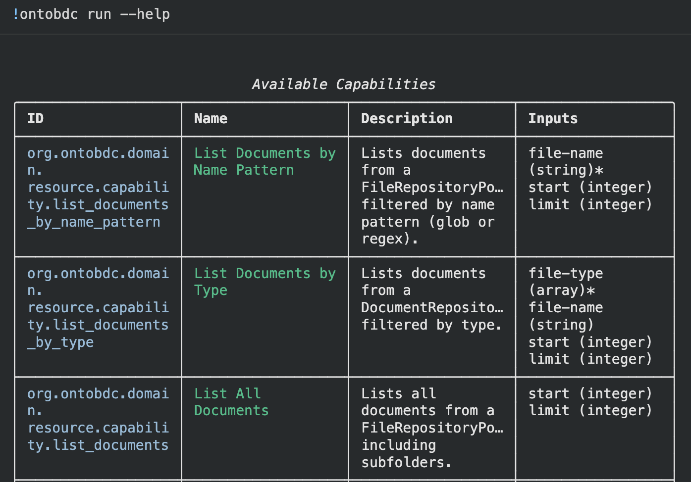
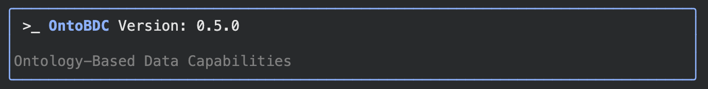
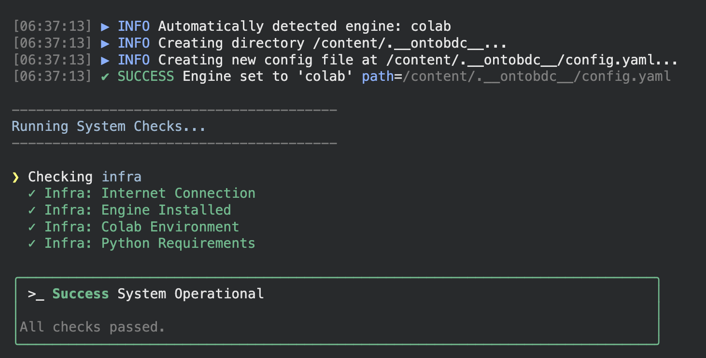
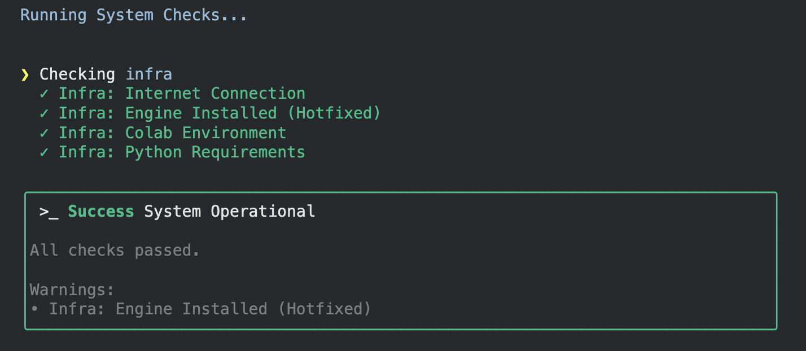

# OntoBDC

> OntoBDC is a domain-driven data architecture for engineering systems.

OntoBDC provides a structured way to define capabilities, actions, and use cases over engineering data.

<p align="left">
  
</p>

It enables reproducible, auditable, and automation-ready workflows across technical domains.

## 🏗️ Used by

OntoBDC is currently used as the core data and execution layer of:

- <a href="https://infobim.org" target="_blank" rel="noopener noreferrer">InfoBIM</a>

InfoBIM leverages OntoBDC to define capabilities, execute checks, and orchestrate engineering data workflows.

## 📦 Requirements

- Python 3.11+
- pip

## 🚀 Getting Started

Install the package:

```sh
pip install ontobdc
```


After installation, the `ontobdc` CLI becomes available:

```sh
ontobdc --version
```


Initialize the project to create the local configuration:

```bash
ontobdc init
```

The `init` command automatically detects the environment (e.g., `venv` or `Google Colab`) and creates the `.__ontobdc__` directory with the base configuration:



Execute capabilities interactively:

```bash
ontobdc run
```

This command launches an interactive menu to discover and execute available capabilities:


From there, you can run other capabilities, perform actions, and interact with registered use cases.


### Alternative: Google Colab

You can try OntoBDC directly in Google Colab without installing anything locally.

<a href="examples/ontobdc_example.ipynb" target="_blank">
  
</a>

View or download the [example notebook](examples/ontobdc_example.ipynb) to see capabilities in action.

## ✅ Checking

The `check` command validates engineering data against defined capabilities and rules.

```sh
ontobdc check --repair
```

It executes registered checks over the target dataset, reports inconsistencies, and optionally applies automated repairs when `--repair` is enabled.

<p align="left">
  
</p>

This ensures reproducibility, auditability, and deterministic validation of engineering workflows.

## 🤝 Contributing

We are always on the lookout for contributors to help us fix bugs, create new features, or help us improve project documentation. If you are interested, feel free to create a [PR](https://github.com/OntoBDC/ontobdc-core/pulls) or open an [issue](https://github.com/OntoBDC/ontobdc-core/issues) on this topic.

## 📄 License

Licensed under **Apache 2.0**.
