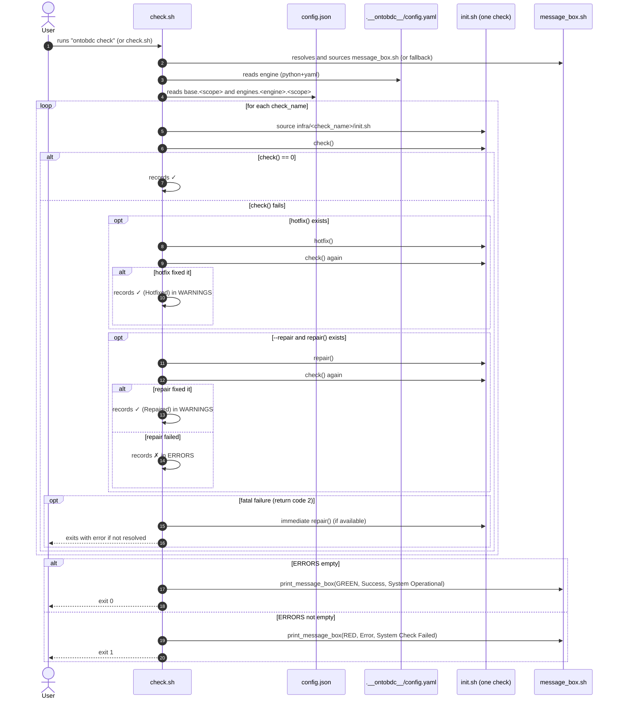

# 1. Purpose

This spec describes how the [check.sh](file:///Users/eliasmpjunior/infobim/deploy/ontobdc-stack/wip/src/ontobdc/check/check.sh) script works. It runs OntoBDC system checks in the terminal, aggregates results, optionally applies fixes, and prints a final summary.

# 2. Inputs and Outputs

## 2.1 Inputs (CLI)

The script accepts simple command-line arguments:

- `--repair`: enables repair attempts for checks that fail and expose `repair()`.
- `--scope <name>`: sets which check scope to run.

Values:

- `--scope all` (default): runs everything available for supported scopes.
- `--scope infra`: runs only infra checks.

## 2.2 Files Used

- `wip/src/ontobdc/check/config.json` (internally referenced as `CONFIG_JSON`): defines which checks run per scope and per engine.
- `.__ontobdc__/config.yaml` (in the current working directory): defines `engine` (e.g., `venv`, `docker`). If missing, there is a Colab heuristic.
- `wip/src/ontobdc/cli/message_box.sh` (or variants): provides `print_message_box` to show colored message boxes.
- `wip/src/ontobdc/check/infra/<check_name>/init.sh`: check implementations.

## 2.3 Outputs (Console)

- Prints a header “Running System Checks...”.
- For each executed check it prints:
  - success: `✓ <description>`
  - failure: `✗ <description>`
  - hotfix applied: `✓ <description> (Hotfixed)`
  - repaired: `✓ <description> (Repaired)`
- At the end it prints a green (success) or red (failure) message box.

## 2.4 Exit Codes

- `0` when there are no errors after running checks (warnings may still exist).
- `1` when one or more checks failed (after considering hotfix/repair).
- For “fatal” failures (return code `2`), the script may exit early with `exit 1` (either inside `repair()` or directly in the runner).

# 3. Dependency Resolution (message_box.sh)

The script tries to locate `message_box.sh` across multiple paths to support:

- “source tree” mode (development), where the script lives under `.../src/ontobdc/check`
- “installed via pip” mode, where the structure may be flattened under `site-packages/ontobdc`

If it cannot find `message_box.sh`, it defines a fallback `print_message_box()` that prints plain text.

# 4. Engine Selection

The script determines `ENGINE` to select additional checks:

1. Default: `venv`
2. If `.__ontobdc__/config.yaml` exists, it tries to read `engine` via Python + PyYAML.
3. If the config does not exist and `/content` exists, it assumes `colab`.

This value is used to load engine-specific checks from `config.json`.

# 5. Check Discovery and Execution

## 5.1 `config.json` Structure

`config.json` is consulted to obtain:

- `base.<scope>`: base checks for a scope (e.g., `infra`)
- `engines.<engine>.<scope>`: additional checks for a specific engine

The union of these lists defines the ordered sequence of checks to execute.

## 5.2 Check Script Location

For each listed `check_name`, the runner looks for:

- `${INFRA_DIR}/${check_name}/init.sh`

If the file does not exist, the check is effectively skipped with a diagnostic message (“Check script not found”).

## 5.3 `init.sh` Contract

Each `init.sh` may define:

- `DESCRIPTION` (string): a human-readable check description
- `check()` (function): returns `0` on success; `1` on failure; `2` on fatal failure
- `hotfix()` (optional function): attempts an automatic fix and returns success/failure
- `repair()` (optional function): attempts a repair, usually used when `--repair` is enabled

The runner sources the `init.sh` and invokes these functions.

# 6. Hotfix, Repair, and Fatal Strategy

## 6.1 Hotfix (Automatic)

When `check()` fails:

- If `hotfix()` exists and returns success, the runner executes `check()` again.
- If the re-validation passes, the check is marked as “Hotfixed” and added to warnings (not errors).

## 6.2 Repair (`--repair`)

When `--repair` is enabled and a check fails:

- If `repair()` exists, the runner calls `repair()`.
- Then it executes `check()` again:
  - if it passes: records “Repaired” as a warning
  - if it fails: records an error

If `repair()` does not exist, the check is recorded as an error.

## 6.3 Fatal Failure (Return Code 2)

If `check()` returns `2`, the runner:

- marks it as “FATAL”
- if `repair()` exists, calls `repair()` immediately (even without `--repair`)
- if `repair()` does not exist, exits with an error

# 7. Aggregation and Final Summary

The runner maintains two lists:

- `ERRORS`: checks that failed and were not resolved
- `WARNINGS`: checks that initially failed but were resolved via Hotfix/Repair

At the end:

- If `ERRORS` is empty: green message box “System Operational” with warnings (if any)
- If `ERRORS` has items: red message box “System Check Failed” listing errors and warnings

# 8. Sequence Diagram (Mermaid)

